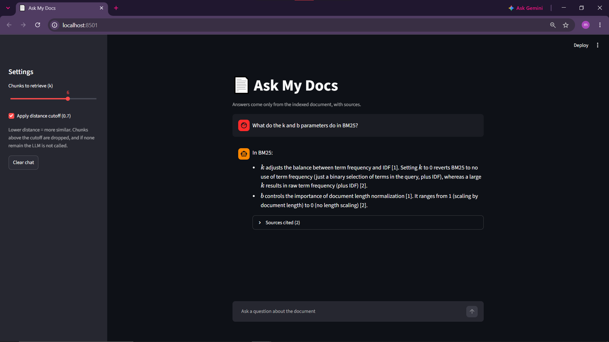

# Ask My Docs

A retrieval-augmented generation (RAG) app that answers questions about a PDF, **cites the passages it used**, and says "I don't know" when the document doesn't contain the answer. Built entirely on free tools: local embeddings, a local vector store, and the Gemini free tier.



## How it works

```
PDF -> pages -> chunks -> MiniLM embeddings (local) -> Chroma (persistent)
                                                          |
question -> embed -> top-k chunks -> distance cutoff -> grounded prompt -> Gemini -> answer with [n] citations
```

- **Chunking:** deterministic chunk IDs (source, page, index), so re-ingesting the same file is idempotent.
- **Embeddings:** `all-MiniLM-L6-v2` via sentence-transformers, run locally (384-dim, normalized, cosine space). No API cost or quota.
- **Retrieval:** Chroma returns the k nearest chunks. Results are converted to plain dataclasses so the rest of the app never depends on Chroma's response shape.
- **Prompt:** numbered context blocks like `[1] (file.pdf, p.4)`. The model must answer only from the context, cite blocks by number, and reply with a fixed fallback sentence if the context is insufficient. The context is explicitly treated as data, not instructions (a basic prompt-injection mitigation).
- **Citations:** `[n]` markers in the answer are parsed and mapped back to chunks, so the UI shows only the sources the model actually used. Out-of-range numbers are ignored.
- **Failures are values:** if every Gemini model fails (rate limit, 5xx), `answer()` returns a friendly message with `ok=False` instead of raising. The LLM client retries transient errors with backoff and falls back across models.

## Evaluation

The retrieval layer is evaluated without calling the LLM, so it is free, fast and deterministic: `python -m evals.run_eval`.

Test set: **22 questions** over one PDF (a draft chapter of Jurafsky & Martin's *Speech and Language Processing*, "Information Retrieval and RAG"): 14 answerable (including 2 paraphrased) and 8 unanswerable (3 clearly off-topic, 5 adjacent or vague). Each answerable question has a hand-checked expected page. A hit means any retrieved chunk comes from an expected page.

| Metric | k=4 | k=6 | k=8 |
|---|---|---|---|
| Hit rate (14 answerable) | 93% | 100% | 100% |
| Worst distance of a correct chunk | 0.591 | 0.679 | 0.679 |

The single k=4 miss was a list-style answer ("steps of the basic RAG algorithm") that ranked 6th, behind chunks that discuss RAG in general. The default is **k=6**, the smallest value that hit everything.

**Finding: no distance threshold cleanly separates unanswerable questions.**

| Query type | Distance of top result |
|---|---|
| Clearly off-topic (capital of Australia, bread recipe, World Cup) | 0.78 to 0.87 |
| Adjacent or vague (attention, word2vec, Elasticsearch, "test", "hello") | 0.56 to 0.76 |
| Worst correct chunk | 0.59 to 0.68 |

The best unanswerable query (0.562) is closer than some correct chunks, so any cutoff that rejects it would also drop real answers. Instead of over-tuning one number, the app uses three layers:

1. **Length guard:** inputs under 8 characters are rejected before retrieval and before any LLM call.
2. **Distance cutoff (0.70):** on this set it rejects 4 of 8 unanswerable questions and drops no correct chunk. If nothing survives, the LLM is not called.
3. **Prompt rule:** the model must return an exact fallback sentence when the context doesn't answer the question. This catches the adjacent-topic questions that pass the cutoff (at the cost of one wasted LLM call).

## Known limitations

- **Small eval:** 22 questions, written by the developer, one document. It shows where each layer breaks; it is not a validated benchmark.
- **Thin threshold margin:** the worst correct chunk (0.679) sits only 0.021 below the 0.70 cutoff. The cutoff would need re-checking after any change to chunking, k, or the embedding model.
- **One PDF at a time.** The UI queries whatever is in the Chroma index and has no upload.
- **Stale chunks:** re-ingesting an edited PDF adds new chunks but does not remove old ones. Delete `data/chroma/` before re-ingesting.
- **PDF extraction noise:** PyMuPDF sometimes interleaves margin labels into the text, which can show up in chunks and snippets.
- **Dense retrieval weakness:** on list-style content, general discussion can outrank the passage with the actual list (the `rag_steps` miss at k=4). A reranker would be the next step.
- **Free-tier LLM:** the Gemini free tier can return 503/429 under load; the retry and fallback logic handles it, but responses can be slow.

## Setup

Requires Python 3.13. Commands are for Windows PowerShell.

```powershell
python -m venv venv
.\venv\Scripts\Activate.ps1
pip install -r requirements.txt

Copy-Item .env.example .env
# edit .env and set GEMINI_API_KEY (free key from Google AI Studio)
```

### Index a PDF

`data/` is git-ignored, so supply your own PDF:

```powershell
python -m scripts.day3_demo data\sample.pdf "What is BM25?"
```

This loads the PDF, chunks it, embeds the chunks and stores them in `data/chroma/` (re-running is safe: chunk IDs are deterministic), then runs the question as a quick retrieval check.

The first run downloads the embedding model (~90 MB) to the Hugging Face cache.

### Run

```powershell
streamlit run streamlit_app.py                 # web UI
python -m scripts.day4_demo "What is BM25?"    # CLI
python -m evals.run_eval --k 6                 # retrieval eval (needs the matching PDF indexed)
python -m pytest tests -q                      # 40 tests, no network or model download needed
```

The sidebar in the UI lets you change k and switch the distance cutoff off, which makes the cutoff's effect visible: with it off, an off-topic question shows six retrieved chunks at distance 0.87 to 0.92.

## Project layout

```
app/
  loader.py      PDF -> pages
  chunker.py     pages -> chunks with deterministic IDs
  embedder.py    local embeddings (lazy-loaded model)
  store.py       Chroma wrapper
  retriever.py   question -> RetrievedChunk list
  prompt.py      grounded prompt builder
  citations.py   [n] marker parser
  llm.py         Gemini client with retry and model fallback
  rag.py         orchestration -> RagResult
  config.py      k, distance cutoff, minimum query length
scripts/         CLI demos (day3_demo: ingest, day4_demo: ask); run with python -m scripts.<name>
evals/           retrieval eval (questions.json, run_eval.py)
tests/           unit tests; embeddings, store and LLM are faked
streamlit_app.py
```

## Design decisions

- **Free stack end to end.** Local embeddings and a local vector store mean the only metered dependency is the Gemini free tier.
- **Lazy imports.** `sentence_transformers` takes about 23 seconds to import on the dev machine, so it is imported inside the cached model loader. Unit tests and module imports don't pay for it, and the UI warms the model once with `st.cache_resource`.
- **Retrieval-only eval.** Retrieval quality is measured separately from generation, so changing chunk size, k, or the embedding model shows up in numbers without spending LLM quota.
- **Pure, small functions.** `build_prompt` and `extract_citations` are pure, and the UI contains no RAG logic, so each piece is unit-testable without mocks of a framework.
- **Plain dataclasses at boundaries.** `RetrievedChunk` and `RagResult` keep the UI and tests independent of Chroma and Gemini response formats.